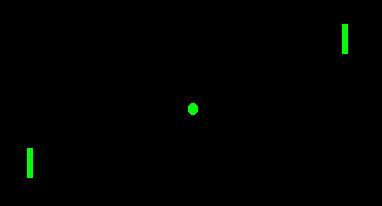
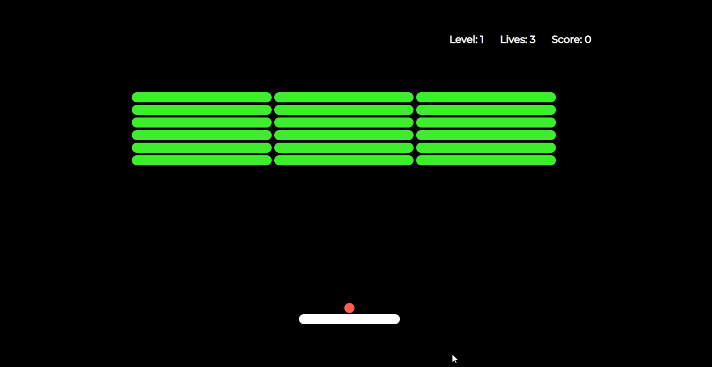

:html_theme.sidebar_secondary.remove:

.. Mushroom documentation master file, created by
   sphinx-quickstart on Wed Dec  6 10:51:04 2017.
   You can adapt this file completely to your liking, but it should at least
   contain the root `toctree` directive.

===============         
  MushroomRL 
===============

A Library for Reinforcement learning
======================================
 
|pic1|  |pic2|

   

What is MushroomRL
------------------

.. highlight:: python

MushroomRL is a Reinforcement Learning (RL) library developed to be a simple, yet
powerful way to make **RL** and **deep RL** experiments. The idea behind MushroomRL
is to offer the majority of RL algorithms providing a common interface
in order to run them without excessive effort. Moreover, it is designed in such
a way that new algorithms and other stuff can be added transparently,
without the need of editing other parts of the code. MushroomRL is compatible with RL
libraries like   
`OpenAI Gym <https://gym.openai.com/>`_,
`DeepMind Control Suite <https://github.com/deepmind/dm_control>`_,
`Pybullet <https://pybullet.org/wordpress/>`_, and
`MuJoCo <http://www.mujoco.org/>`_, and
the `PyTorch <https://pytorch.org>`_ library for tensor computation.

   

|pic3| |pic5| |pic4| |pic6| |pic7|
     
     
   

   

.. toctree::
   :caption: Getting Started:
   :maxdepth: 1
   :glob:
   :hidden:

   source/user_guide

.. toctree::
   :caption: Features:
   :maxdepth: 2
   :glob:
   :hidden:

   /Features

.. toctree::
   :caption: Tutorials:
   :maxdepth: 2
   :glob:
   :hidden:

   /Tutorials

